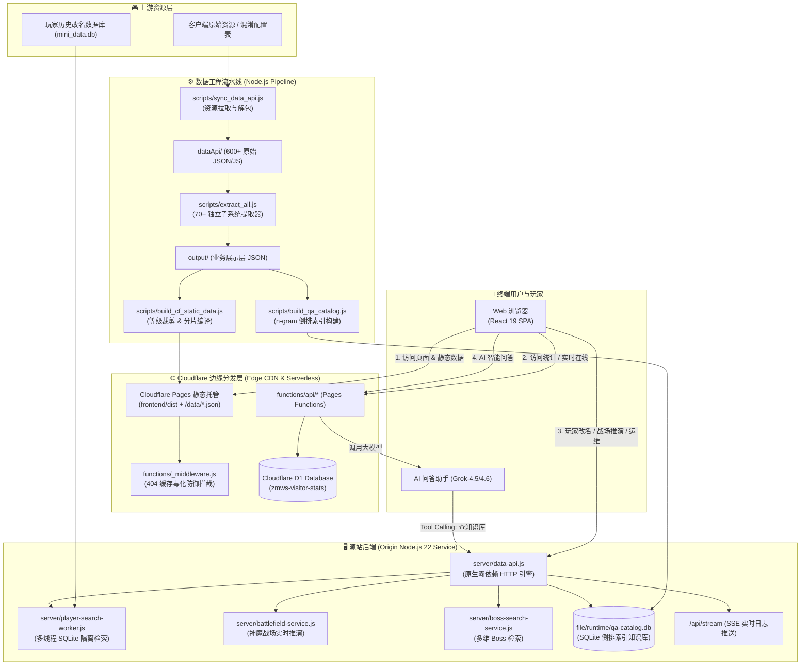
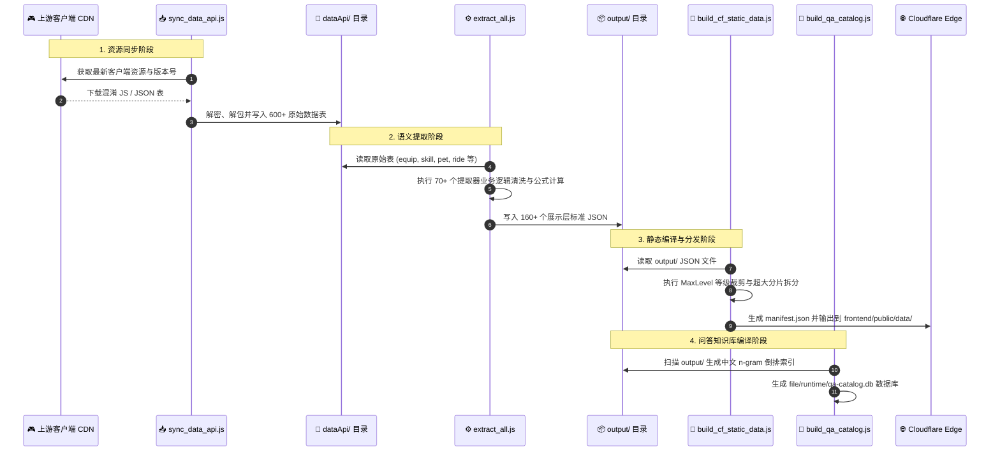
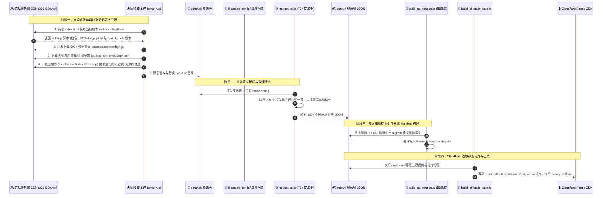

# 造梦无双数据站 (Deployable App CF)

<div align="center">


<p align="center">
  <b>面向《造梦无双》的大型深度数据挖掘、数值机制推演、全系统 Wiki 知识库、战力测算工具与全自动运维监控平台</b>
</p>

[🌐 访问主站 (Edge CDN)](https://data.zmwsrank.top) • [⚙️ API 服务端](https://api.zmwsrank.top) • [📖 开发与机制文档](./docs/开发文档.md) • [💬 交流反馈 QQ 群](https://qm.qq.com/cgi-bin/qm/qr?k=681321644) (681321644)

</div>

---

## 目录 (Table of Contents)

- [1. 项目概述与定位](#1-项目概述与定位)
- [2. 核心系统架构与技术选型](#2-核心系统架构与技术选型)
  - [2.1 架构拓扑全景图](#21-架构拓扑全景图)
  - [2.2 技术栈清单](#22-技术栈清单)
  - [2.3 关键架构创新与设计哲学](#23-关键架构创新与设计哲学)
- [3. 业务系统与全景 Wiki 矩阵](#3-业务系统与全景-wiki-矩阵)
  - [3.1 角色技能与绝技 Wiki (`role_wiki`)](#31-角色技能与绝技-wiki-role_wiki)
  - [3.2 极限属性推演引擎 (`role_extreme_stats`)](#32-极限属性推演引擎-role_extreme_stats)
  - [3.3 角色装备全生命周期 (`role_equip`)](#33-角色装备全生命周期-role_equip)
  - [3.4 灵宝三维矩阵：法宝 / 神器 / 阵法 (`role_spiritual`)](#34-灵宝三维矩阵法宝--神器--阵法-role_spiritual)
  - [3.5 异火、星石与星核系统 (`role_starstone`)](#35-异火星石与星核系统-role_starstone)
  - [3.6 修炼大系与 32 丹元家族 (`role_cultivate`)](#36-修炼大系与-32-丹元家族-role_cultivate)
  - [3.7 宠物系统与 12 神兽深度 Wiki (`pet`)](#37-宠物系统与-12-神兽深度-wiki-pet)
  - [3.8 万兽天梯与历史战力清洗 (`beast_stats`)](#38-万兽天梯与历史战力清洗-beast_stats)
  - [3.9 坐骑系统与 8 大坐骑 Wiki (`ride`)](#39-坐骑系统与-8-大坐骑-wiki-ride)
  - [3.10 请神战场、魔王与天赋树 (`call_god`)](#310-请神战场魔王与天赋树-call_god)
  - [3.11 全关卡 BOSS 属性与防御抗值标准 (`boss` / `resist`)](#311-全关卡-boss-属性与防御抗值标准-boss--resist)
  - [3.12 守护昆仑塔防与 PVP 平衡 (`kunlun`)](#312-守护昆仑塔防与-pvp-平衡-kunlun)
  - [3.13 大闹天宫局内道具肉鸽机制 (`rogue_item`)](#313-大闹天宫局内道具肉鸽机制-rogue_item)
  - [3.14 关卡收益、资源获取与战力门槛 (`stage_rewards` / `resource` / `power`)](#314-关卡收益资源获取与战力门槛-stage_rewards--resource--power)
  - [3.15 玩家改名历史极速追踪 (`player_lookup`)](#315-玩家改名历史极速追踪-player_lookup)
  - [3.16 智能 RAG 问答助手 (`qa`)](#316-智能-rag-问答助手-qa)
  - [3.17 运维监控与实时流控制台 (`ops`)](#317-运维监控与实时流控制台-ops)
- [4. 数据工程流水线与更新机制](#4-数据工程流水线与更新机制)
  - [4.1 数据流水线流转图](#41-数据流水线流转图)
  - [4.2 核心处理脚本索引](#42-核心处理脚本索引)
  - [4.3 自动化流水线触发](#43-自动化流水线触发)
- [5. 目录结构全景索引](#5-目录结构全景索引)
- [6. 本地开发与调试指南](#6-本地开发与调试指南)
  - [6.1 环境要求](#61-环境要求)
  - [6.2 环境变量配置](#62-环境变量配置)
  - [6.3 启动本地开发服务](#63-启动本地开发服务)
- [7. 生产构建与 Cloudflare 部署](#7-生产构建与-cloudflare-部署)
  - [7.1 Cloudflare Pages 平台配置](#71-cloudflare-pages-平台配置)
  - [7.2 Cloudflare D1 数据库初始化与迁移](#72-cloudflare-d1-数据库初始化与迁移)
  - [7.3 Windows 一键全自动部署](#73-windows-一键全自动部署)
  - [7.4 Origin 服务器独立部署与守护](#74-origin-服务器独立部署与守护)
- [8. API 接口全景清单](#8-api-接口全景清单)
  - [8.1 静态数据分片 API (Edge CDN)](#81-静态数据分片-api-edge-cdn)
  - [8.2 Cloudflare Pages Functions 接口 (Edge Serverless)](#82-cloudflare-pages-functions-接口-edge-serverless)
  - [8.3 Origin 服务端动态接口 (Node.js API)](#83-origin-服务端动态接口-nodejs-api)
- [9. 安全、性能与高级机制](#9-安全性能与高级机制)
- [10. 规范与开发准则](#10-规范与开发准则)

---

## 1. 项目概述与定位

《造梦无双》作为一款机制丰富、数值系统庞大的横版动作角色扮演游戏，其客户端底层配置繁复，官方描述往往存在模糊、隐藏判定（如多段判定帧、伤害公式系数、隐藏抗性阈值、满潜成长天花板等）的情况。

**本项目（Deployable App CF）** 是一套端到端的数据解构、离线编译、全系统推演、交互展示与运维管理平台：
1. **深度逆向解构**：从游戏客户端提取 600+ 张原始数据表，编写了 70+ 个专用提取器，将底层混淆字段清洗并重组为具备业务语义的结构化 JSON。
2. **全系统数值 Wiki**：完整覆盖角色 9 大职业、绝技、极限满配属性、装备熔炼镶嵌、法宝神器阵法、32 丹元家族、12 神兽宠物、8 大坐骑、全副本 Boss 抗性、守护昆仑塔防、肉鸽遗物人话解析等 24 个业务模块。
3. **混合分布式架构**：
   - **全球边缘分发 (Cloudflare Pages + CDN)**：将超过 100MB+ 的结构化游戏数据在构建期预编译为静态 JSON 分片，由 Cloudflare 边缘节点直接缓存和分发，实现全球毫秒级静态数据响应。
   - **边缘无服务器统计 (Cloudflare Pages Functions + D1 数据库)**：将原本依赖传统数据库的访客追踪、实时在线人数计算、PV/UV 聚合迁移至全球分布式边缘数据库 Cloudflare D1。
   - **源站核心推演 (Origin Node.js API)**：源站专注于玩家改名多线程 SQLite 极速检索、实时神魔战场推演、QA 倒排索引检索引擎及自动化运维流。

---

## 2. 核心系统架构与技术选型

### 2.1 架构拓扑全景图



### 2.2 技术栈清单

| 分层 | 技术选型 | 版本/规范 | 用途与核心优势 |
| :--- | :--- | :--- | :--- |
| **前端视图** | **React** | `v19.2.0` | 并发渲染模式、Suspense 路由级按需代码分割 |
| | **TypeScript** | `v5.9.3` | 全链路类型安全，严格模式定义全部游戏数据结构 |
| | **Vite** | `v7.3.1` | 秒级冷启动、Rollup 分包优化 (`chart-vendor` 等切片) |
| | **Tailwind CSS** | `v4.2.1` | 原生 CSS 变量驱动、极致现代感、支持深色模式切换 |
| | **Recharts** | `v3.7.0` | 角色属性曲线、万兽天梯阵容走势图、数据可视化 |
| | **KaTeX** | `v0.17.0` | 高性能数学公式渲染 (游戏伤害公式、收益期望公式) |
| | **Fuse.js** | `v7.1.0` | 客户端轻量级模糊全文搜索与高亮定位 |
| | **Lucide React**| `v0.577.0`| 现代统一设计语言图标库 |
| **边缘计算** | **Cloudflare Pages** | - | 全球 Anycast 边缘 CDN 加速托管，0 运维成本 |
| | **Pages Functions** | V8 Isolated | 基于 Web Standards 的 Serverless 接口，超低冷启动延迟 |
| | **Cloudflare D1** | SQLite at Edge | 分布式无服务器 SQL 数据库，承载海量高并发访客统计 |
| | **Wrangler** | `v4.124.0` | Cloudflare 开发者 CLI，支持本地仿真与一键部署 |
| **源站后端** | **Node.js** | `v22.x+` | 原生 `node:http` 无额外框架损耗，高吞吐低内存占用 |
| | **Worker Threads**| Native | 线程隔离机制，防止大数据库搜索阻塞主事件循环 |
| | **node:sqlite** | Native | Node 22 内置 `DatabaseSync`，免去 C++ 原生编译依赖 |
| | **SSE Stream** | RFC 8895 | 基于 Server-Sent Events 的运维流水线实时日志推送 |
| **数据工程** | **Cocos Parser** | ECMAScript | 游戏资源逆向解密、反序列化与数据字典建立 |
| | **n-gram Engine**| 2-gram / 3-gram | 专为游戏名词与机制设计的倒排索引检索算法 |

### 2.3 关键架构创新与设计哲学

#### ① 404 缓存毒化防御中间件 (`frontend/functions/_middleware.js`)
* **痛点问题**：在传统 SPA 单页应用中，静态托管平台通常配置 `/* /index.html 200` 用于支持前端 History 路由。当网站版本更新后，用户浏览器中留存的旧版 HTML 仍会尝试请求旧哈希 chunk（如 `/assets/chart-vendor-abc123.js`）。该请求找不到文件时会被 `_redirects` 回退并返回 `index.html`（状态码 200），且带有 `/assets/*` 的强缓存头 `Cache-Control: max-age=31536000, immutable`。浏览器将 HTML 当作 JS 脚本强缓存 1 年，造成控制台报 `MIME type of "text/html"` 错误且用户刷新也无法恢复的**致命白屏死锁**。
* **解决方案**：中间件对所有带静态资源后缀（`.js`, `.css`, `.json`, `.png`, `.jpg`, `.svg`, `.woff2` 等）的请求进行精确嗅探。若底层回退响应为 `text/html`，中间件强制改写为真实的 **`404 Not Found`** 并附带 **`Cache-Control: no-store`**。错误诚实暴露且不会被浏览器缓存，用户只需单次刷新即可平滑自愈。

#### ② 基于 Cloudflare D1 的全球分布式边缘统计 (`_visitor-stats.js`)
* **架构解耦**：不再将高频打点（每位玩家访问/路由切换/心跳）打到源站服务器，彻底消除源站数据库连接池耗尽风险。
* **机制设计**：
  - **实时在线统计**：采用 5 分钟滑动时间窗口计算当前活跃访客。
  - **访问会话合并**：30 分钟内同一 `visitorId` 归为单次会话，精准计算真实浏览量与留存。
  - **自适应防刷限流**：单 IP 60 秒内限制最多 120 次注册上报。
  - **历史归档清理**：以 `Asia/Shanghai` 时区每日聚合 UV/PV，自动保留 60 天数据，定期清理过期孤儿记录。

#### ③ 主线程非阻塞的 SQLite 多线程检索 (`player-search-worker.js`)
* `mini_data.db` 包含海量玩家改名轨迹数据。为了避免模糊查询 (`LIKE %name%`) 引起主事件循环卡顿，采用 Node.js `worker_threads` 构建专用搜索 Worker，请求通过序列号 `seq` 实现超时可控（默认 8000ms）的异步 Promise 通信，兼顾高并发与吞吐量。

#### ④ 高性能轻量级 RAG 知识库问答体系 (`qa-catalog.js` + `build_qa_catalog.js`)
* 不依赖沉重且昂贵的向量数据库（Vector DB），而是将 100+ 份输出 JSON 编译为紧凑的 SQLite 中文 n-gram 倒排索引库 (`qa-catalog.db`)。
* 知识库索引仅保存元数据、结构化摘要、中文 Token 及 JSON Pointer 指针。AI 模型在调用工具时，仅需传输几十 KB 的精确片段（限制最大 128KB），大幅降低大模型 Token 消耗并杜绝“幻觉”。

---

## 3. 业务系统与全景 Wiki 矩阵

系统共划分为 **24 大业务子系统**，涵盖超过 100+ 核心视图与数据报表：

```text
┌──────────────────────────────────────────────────────────────────────────────────┐
│                             造梦无双数据站系统导航矩阵                             │
├──────────────────────┬──────────────────────┬────────────────────────────────────┤
│ 1. 角色核心体系      │ 2. 伙伴与战场体系    │ 3. 挑战与收益体系                  │
│  ├─ 角色技能 Wiki    │  ├─ 宠物系统 (12神兽)│  ├─ Boss 属性与抗性标准            │
│  ├─ 极限属性推演     │  ├─ 万兽天梯数据统计 │  ├─ 守护昆仑塔防分析               │
│  ├─ 角色装备全流程   │  ├─ 坐骑系统 (8坐骑) │  ├─ 局内道具 (肉鸽遗物人话)        │
│  ├─ 灵宝矩阵 (法/神/阵)│ ├─ 请神战场与魔王解析│ ├─ 关卡奖励与掉落期望            │
│  ├─ 星石与星核系统   │  └─ 神魔实时推演工具 │  ├─ 战力门槛全景汇总               │
│  ├─ 修炼大系 (32丹元)│                      │  └─ 资源获取途径 (宝箱/黑市/秘商)  │
│  ├─ 时装与称号       │                      │                                    │
│  └─ 翅膀培养体系     │                      │                                    │
├──────────────────────┴──────────────────────┴────────────────────────────────────┤
│ 4. 玩家工具、知识库与运维体系                                                    │
│  ├─ 玩家改名历史极速追踪 (Player Lookup)   ├─ 游戏底层冷知识机制库 (Cold Knowledge)│
│  ├─ 智能 RAG 问答助手 (QA Assistant)      ├─ 运维管理控制台与 SSE 日志流 (Ops) │
└──────────────────────────────────────────────────────────────────────────────────┘
```

### 3.1 角色技能与绝技 Wiki (`role_wiki`)
* **路由路径**：`/role_wiki/:roleId`
* **支持角色**：孙悟空 (`wukong`)、唐三藏 (`tangseng`)、沙悟净 (`shaseng`)、猪八戒 (`bajie`)、萧嫣 (`xiaoyan`)、敖雪 (`aoxue`)、敖烈 (`aolie`)、九天玄女 (`xuannv`)、杨戬 (`yangjian`) 以及绝技无双 (`skill_extra`)。
* **解析深度**：
  - 动作总耗时（帧数/秒）、实际伤害段数与每段伤害结算时间点。
  - 技能攻击倍率与固定值成长、等级提升阶梯。
  - 霸体机制、浮空高度、击退距离、无敌帧（Invincibility Frames）区间。
  - 双系觉醒技能（如烈焰/火魔、冰霜/玄冰）词条效果与连招分支收益。

### 3.2 极限属性推演引擎 (`role_extreme_stats`)
* **路由路径**：`/extreme_stats`
* **底层数据**：`role_extreme_stats_source_map.json`、`role_extreme_stats_stage_curves.json`
* **功能亮点**：
  - 测算全角色在理论极限（满级、满潜能、满强化、完美词条、全羁绊激活）下的攻击、防御、生命、暴击、暴伤、回血等属性天花板。
  - 完整的属性来源分解映射图（Source Map），清晰透视各大系统（装备、丹元、星石、称号等）在总体战力中的贡献占比与边际收益曲线。

### 3.3 角色装备全生命周期 (`role_equip`)
* **路由路径**：`/user_equip/:subTab` (`make` 打造 / `upgrade` 强化 / `smelt` 熔炼 / `stone` 宝石)
* **核心内容**：
  - 各品阶（凡品、良品、上品、极品、仙品、神品）装备打造所需消耗材料与图纸掉落点。
  - 装备强化成功率、强化属性加成公式与强化突破材料。
  - 装备熔炼属性成长区间、重铸消耗与最优词条组合。
  - 宝石镶嵌孔位解锁规则、各属性宝石属性加成阶梯。

### 3.4 灵宝三维矩阵：法宝 / 神器 / 阵法 (`role_spiritual`)
* **路由路径**：`/user_spiritual/:type/:subTab`
* **子系统矩阵**：
  - **法宝系统 (`magic`)**：法宝升级消耗、附灵属性加成、聚灵共鸣、主动法宝技能倍率与被动光环效果。
  - **神器系统 (`godweapon`)**：神兵解锁前置、升阶材料、神器专属词条技能与战斗触发生效机制。
  - **阵法系统 (`matrix`)**：阵眼激活顺序、阵图升级消耗、阵法共鸣全队增益属性与阵法大招实战解析。

### 3.5 异火、星石与星核系统 (`role_starstone`)
* **路由路径**：`/user_starstone/effects`
* **底层数据**：`role_starstone.json`、`role_starstone_effect.json`、`role_starstone_effect_all.json`
* **机制解析**：
  - 覆盖全部攻击类与防御类星石词条 (`starStoneAffix`)。
  - **极效词条解锁机制**：精确展示每 10 级（10/20/30/40/50...）解锁的质变极效属性与特殊被动技能（`skillId`/`skillIdSuper`）。
  - 支持玩家自选词条等级进行最终属性模拟推演；星劫产出池与品质成长率一览。

### 3.6 修炼大系与 32 丹元家族 (`role_cultivate`)
* **路由路径**：`/user_cultivate/:subTab` (`heart` 心法 / `inner/danqi` 丹气 / `inner/danyuan` 丹元 / `inner/danyuan_effect` 丹元效果 / `body` 经脉炼体)
* **丹元 32 大家族全拆解**：
  - 针对游戏内官方描述模糊的 32 个丹元家族（涵盖回血、暴击增伤、技能冷却缩减、受击反伤、异常状态抗性等），逐一提供经过逆向验证的“白话机制解释”、触发概率、内置冷却（ICD）以及各品质（绿/蓝/紫/橙/红）数值阶梯。

### 3.7 宠物系统与 12 神兽深度 Wiki (`pet`)
* **路由路径**：`/pet/:subTab` (`skill` 技能 / `wiki` 神兽百科 / `star` 升星 / `equip` 装备)
* **12 大专属神兽深度档案**：
  - 白虎战神、炽焰/极光猴王、神霄花仙/玄蝶仙子/千年冰狐/圣冰天狐、暗夜/冥甲鼠王、圣力神牛/圣雪圆圆、麒麟、青龙妖圣、天蛇元君、皓月/暗月兔皇、圣木/圣砂王蛇、玄武大帝、朱雀炎皇。
* **机制与算法**：
  - 宠物技能基准值 $X$ 换算公式与全等级数值表。
  - 潜能资质对基础属性的换算倍率与洗练上限。
  - 宠物装备打造、升星、词条洗练与套装效果。

### 3.8 万兽天梯与历史战力清洗 (`beast_stats`)
* **路由路径**：`/pet_champion/:subTab` (`stages` 赛程阶段 / `detail` 冠军详情 / `lineup` 阵容趋势 / `players` 兽王榜)
* **数据洞察**：
  - 汇总历届万兽争霸赛冠军玩家阵容与配置。
  - 基于海量斗坛对局历史数据清洗出的核心阵容出场率、胜率变化曲线。
  - 顶尖高手的宠物战力搭配模型与打法偏好。

### 3.9 坐骑系统与 8 大坐骑 Wiki (`ride`)
* **路由路径**：`/ride/:subTab` (`star` 升星 / `skill` 技能 / `wiki` 坐骑百科 / `make` 打造 / `upgrade` 升级)
* **8 大专属坐骑百科**：
  - 谛听、赤凤/赤炎凤凰/青鸾/寒冰凤凰、金毛犼/冲天神犼、避火魔睛兽/至尊魔睛兽/避水金睛兽/至尊金睛兽、年兽/上古年兽/永冬年兽、天禄/辟邪 (貔貅)、青狮/青鬃狮王、汪汪/超级汪。
* **全生命周期解析**：坐骑技能系数 $X$、心情机制（饱食度与属性增益关系）、坐骑装备打造、重铸与升阶消耗。

### 3.10 请神战场、魔王与天赋树 (`call_god`)
* **路由路径**：`/call_god/:subTab` (`stats` 属性 / `limits` 阶段上限 / `stones` 灵石收益 / `boss` 魔王解析 / `common_skills` 通用技能 / `talents` 天赋树)
* **深度数据**：
  - 请神基础属性模板与阶段倍率换算公式。
  - 请神魔王攻击模式、弱点抗性与打法策略。
  - 天赋树点法收益比与神石掉落期望测算。

### 3.11 全关卡 BOSS 属性与防御抗值标准 (`boss` / `resist`)
* **路由路径**：`/boss/:category` 与 `/resist/standard`
* **Boss 数据库涵盖 20+ 类别**：
  - 主线关卡 (`mainline`)、幻境 (`illusion`)、罗汉堂 (`arhat_hall`)、神兽森林 (`divine_beast_forest`)、梦魇关卡 (`nightmare`)、宠物天梯 (`pet_ladder`)、隐蔽山洞 (`hidden_cave`)、七夕活动 (`qixi_event`)、昆仑山 (`kunlun`)、混沌之门 (`chaos_gate`)、帮派 Boss (`guild_boss`)、精英关卡 (`elite_stage`)、福利秘境 (`benefit_realm`)、召妖山 (`zhaoyao_mountain`)、秘海遗迹 (`secret_sea_ruins`)、七星战场 (`seven_star_battlefield`)、决阵四大模式 (`juezhen_*`)、玲珑塔 (`linglong_tower`)、兜率宫 (`doushuai_palace`) 及小怪全库 (`mobs`)。
* **抗值标准**：直观展示 `exp.json` 中的防御抗值衰减模型与通用抗值免伤标准对照表。

### 3.12 守护昆仑塔防与 PVP 平衡 (`kunlun`)
* **路由路径**：`/kunlun/:subTab` (`towers` 防御塔 / `stages` 波次 / `pvp` 平衡分析)
* **机制解析**：解析守护昆仑塔防模式中全部防御塔的攻击类型、射程、攻速、升阶属性，以及全关卡波次怪物刷新与 PVP 攻防平衡推演。

### 3.13 大闹天宫局内道具肉鸽机制 (`rogue_item`)
* **路由路径**：`/rogue_item/list`
* **核心亮点**：大闹天宫肉鸽模式中遗物众多且官方描述晦涩。本模块通过逆向战斗判定配置，提供经过严格测试的“人话版”遗物机制说明，包含触发条件、叠加上限、内置 CD、乘区类型与数值修正。

### 3.14 关卡收益、资源获取与战力门槛 (`stage_rewards` / `resource` / `power`)
* **关卡收益 (`stage_rewards`)**：各关卡基础经验、灵魂产出及期望掉落物品概率分布。
* **资源获取 (`resource_acquisition`)**：惊喜宝箱池、神秘商店、黑市商店等全部稀有道具掉落与兑换树。
* **战力需求 (`power_requirements`)**：神魔星级、玲珑宝塔品阶、主线与噩梦副本等全玩法推荐战力门槛汇总。

### 3.15 玩家改名历史极速追踪 (`player_lookup`)
* **路由路径**：`/player_lookup/search`
* **功能特性**：输入玩家 UID，秒级检索其在游戏中的全部历史曾用名、改名时间点及角色变迁轨迹。底层由专用多线程 Worker 驱动 SQLite 查询，提供精准与模糊搜索。

### 3.16 智能 RAG 问答助手 (`qa`)
* **路由路径**：`/qa`
* **技术亮点**：
  - 前端 Pages Function 协同调用大语言模型（如 Grok-4.5 / Grok-4.6）。
  - 大模型通过 Function Calling 驱动源站 `/api/qa/catalog/*` 接口，在倒排索引知识库中秒级检索技能系数、关卡掉落、机制细节，生成准确、严谨的结构化回答。

### 3.17 运维监控与实时流控制台 (`ops`)
* **路由路径**：`/ops/dashboard` (需管理员权限或特定模式开启)
* **核心功能**：
  - 服务健康状态、内存占用、SQLite 连接状态实时大盘。
  - 一键执行上游同步、一键提取、一键构建发布。
  - 基于 Server-Sent Events (SSE) 的终端日志实时流式渲染。

---

## 4. 数据工程流水线与更新机制

### 4.1 数据流水线流转图



### 4.1 数据流水线流转图



### 4.2 核心更新脚本全景矩阵

| 脚本路径 | 核心功能与参数说明 | 产物目录 / 影响范围 |
| :--- | :--- | :--- |
| [`scripts/sync_data_api.js`](file:///d:/zmws/Server/deployable-app-cf/scripts/sync_data_api.js) | **从游戏服务器拉取全量基础配置表**。<br>`node scripts/sync_data_api.js [client_url]`<br>• 解析游戏 `settings.js`，并发下载 600+ 原始 JS 表并转换为 JSON。<br>• 自动解析 `main-index.js` 提取运行时内嵌表（吐纳 `breathing`、穴位 `breathingAcupoint`）。<br>• 支持 staging 原子暂存与 backup 故障回滚机制。 | `dataApi/*.js`<br>`dataApi/*.json`<br>`data/runtime/main-index.js` |
| [`scripts/sync_battle_config.js`](file:///d:/zmws/Server/deployable-app-cf/scripts/sync_battle_config.js) | **从游戏服务器拉取战斗与实体弹幕配置**。<br>`node scripts/sync_battle_config.js [--refresh-manifest] [--overwrite] [client_url]`<br>• 下载子弹配置 `bullets.json` 与实体战斗属性 `entityCtg/*.json`。<br>• 为技能伤害公式、弹幕判定、Boss 攻击判定提供底层支撑。 | `file/battle-config/`<br>`file/runtime/cocos-battle-config-manifest.json` |
| [`scripts/sync_maps.js`](file:///d:/zmws/Server/deployable-app-cf/scripts/sync_maps.js) | **从游戏服务器拉取全关卡地图配置**。<br>`node scripts/sync_maps.js [--overwrite] [client_url]`<br>• 扫描并拉取 Cocos `resources` bundle 中的全部地图 JSON 资源。 | `file/map-cache/`<br>`file/runtime/cocos-map-manifest.json` |
| [`scripts/update_main_data_api.js`](file:///d:/zmws/Server/deployable-app-cf/scripts/update_main_data_api.js) | **拉取配置表并归档带版本哈希的主程序**。<br>`node scripts/update_main_data_api.js [client_url]`<br>• 执行 `sync_data_api.js` 并将 `index.<md5>.js` 归档留存，便于版本对比。 | `dataApi/`<br>`data/runtime/index.<md5>.js` |
| [`scripts/cocos_resource_downloader.mjs`](file:///d:/zmws/Server/deployable-app-cf/scripts/cocos_resource_downloader.mjs) | **Cocos Creator 资源专用下载与解密扫描器**。<br>`node scripts/cocos_resource_downloader.mjs scan/download [options]`<br>• 支持 Cocos bundle 递归扫描、UUID 资源寻址与断点重试。 | `file/runtime/` |
| [`scripts/extract_all.js`](file:///d:/zmws/Server/deployable-app-cf/scripts/extract_all.js) | **70+ 子系统业务数据提取总调度**。<br>`node scripts/extract_all.js [module_key...]`<br>• 将 `dataApi/` 原始数据清洗重构为前端可用业务 JSON。 | `output/*.json` (160+ 文件) |
| [`scripts/build_system_data.js`](file:///d:/zmws/Server/deployable-app-cf/scripts/build_system_data.js) | **聚合构建系统 Manifest 与小体积结构化包**。 | `output/system_data_manifest.json` |
| [`scripts/build_qa_catalog.js`](file:///d:/zmws/Server/deployable-app-cf/scripts/build_qa_catalog.js) | **编译知识库中文 n-gram 倒排索引**。 | `file/runtime/qa-catalog.db` |
| [`scripts/build_cf_static_data.js`](file:///d:/zmws/Server/deployable-app-cf/scripts/build_cf_static_data.js) | **Cloudflare 静态分片编译与 MaxLevel 裁剪**。 | `frontend/public/data/*.json`<br>`frontend/public/data/manifest.json` |
| [`scripts/run_update_pipeline.js`](file:///d:/zmws/Server/deployable-app-cf/scripts/run_update_pipeline.js) | **端到端一键更新流水线总控**（全量自动拉取 $\to$ 提取 $\to$ 知识库编译 $\to$ 差异对比）。 | 触发上述所有流程并生成变更报告 |

---

### 4.3 如何从游戏服务器拉取新版本（操作实战）

#### 🚀 场景 1：游戏常规更新，一键全自动拉取与更新（推荐）

直接运行端到端全量更新流水线：

```bash
# 在项目根目录下执行
node scripts/run_update_pipeline.js
```

**流水线内部自动执行以下 7 个步骤**：
1. `sync_maps.js`：从游戏服务器拉取最新地图配置到 `file/map-cache/`。
2. `sync_battle_config.js`：拉取子弹弹幕与战斗实体属性到 `file/battle-config/`。
3. `sync_data_api.js`：拉取 600+ 原始配置表与运行时主程序内嵌表到 `dataApi/`。
4. `extract_all.js`：调度 70+ 个提取器清洗并生成最新 `output/*.json`。
5. `build_system_data.js`：生成系统数据 Manifest。
6. `build_qa_catalog.js`：重构 RAG 问答 SQLite 倒排索引 `qa-catalog.db`。
7. **生成差异报告**：在 `file/runtime/update-change-report.json` 输出新增/修改/删除的文件列表及哈希变化。

---

#### 🎯 场景 2：从特定提审服 / 测试服拉取资源

若游戏处于提审服、测试服或特定 CDN 节点，可直接向脚本传入自定义 URL：

```bash
# 1. 从指定测试服 URL 拉取基础配置
node scripts/sync_data_api.js "https://test-client-zmxyol.3304399.net/client/"

# 2. 从指定测试服拉取战斗实体与子弹配置 (强制刷新清单与覆盖)
node scripts/sync_battle_config.js --refresh-manifest --overwrite "https://test-client-zmxyol.3304399.net/client/"

# 3. 从指定测试服拉取地图资源
node scripts/sync_maps.js --overwrite "https://test-client-zmxyol.3304399.net/client/"
```

---

#### 🔍 场景 3：单模块精细化更新与调试

当开发者只需提取或调试某一个子系统（如只关心新出的宠物或角色技能）时：

```bash
# 步骤 1: 仅同步配置表
node scripts/sync_data_api.js

# 步骤 2: 仅提取宠物与坐骑模块
node scripts/extract_all.js pet ride

# 步骤 3: 仅提取角色技能 Wiki
node scripts/extract_all.js role_wiki

# 步骤 4: 仅提取特定装备与法宝
node scripts/extract_all.js equip magic
```

---

#### 🖥️ 场景 4：通过 Web 运维后台可视化一键拉取

对于线上运行节点或无需登录终端的场景，可通过 Web 控制台触发更新：

1. 浏览器访问：`https://data.zmwsrank.top/ops/dashboard`（或本地 `http://localhost:5173/ops/dashboard`）。
2. 在右上角设置中填入环境变量配置的 `ADMIN_TOKEN`。
3. 点击 **「执行上游同步 (Sync)」** 或 **「完整流水线 (Pipeline)」**。
4. 源站后端（`server/data-api.js`）将通过子进程执行同步脚本，并通过 **SSE (`/api/stream`)** 实时将终端下载进度与提取日志推送到浏览器控制台。

---

### 4.4 数据拉取后的 Cloudflare 部署发布

拉取并提取完成后，将新版本发布到 Cloudflare Pages 仅需一步：

```powershell
# Windows 一键编译静态分片并发布到 Cloudflare Pages
.\deploy-cf.bat
```

**`deploy-cf` 脚本会自动完成**：
1. 执行 `node scripts/build_cf_static_data.js`：
   - 根据 `app-config.js` 的 `maxLevel` 裁剪未开放等级的数据。
   - 生成 `frontend/public/data/manifest.json` 与各模块分片 JSON。
2. 进入 `frontend/` 执行 `npm run build` 打包前端 Vite 产物到 `frontend/dist`。
3. 调用 `wrangler pages deploy dist` 自动上传部署到全球 Cloudflare CDN 节点。

---

### 4.5 故障安全与原子回滚保护机制

为了防止网络波动导致配置表下载中途失败而污染本地运行环境，`sync_data_api.js` 设计了**三级隔离防护体系**：

```text
┌────────────────┐     全部成功     ┌──────────────┐     成功替换     ┌─────────────┐
│ dataApi.staging│ ───────────────> │ dataApi (正式)│ ───────────────> │  删除备份   │
└────────────────┘                  └──────────────┘                  └─────────────┘
        │                                  │
        │ 中途失败 (如 404/超时)            │ 替换失败
        ▼                                  ▼
┌────────────────┐                  ┌──────────────┐
│  清空 staging  │                  │回滚 dataApi. │
│   保留原数据   │                  │    backup    │
└────────────────┘                  └──────────────┘
```

1. **临时暂存 (`dataApi.staging/`)**：所有网络请求与 JSON 转换均在临时目录执行，主目录完全不受影响。
2. **原子切换**：只有当全部 600+ 张表 100% 下载且 JSON 解析无误后，才将原 `dataApi/` 移入 `dataApi.backup/`，并将 `staging` 原子更名为 `dataApi/`。
3. **异常自愈**：若在切换过程中发生 I/O 异常，脚本会自动从 `backup` 目录无损恢复原数据，并删除残缺的临时目录。

---

## 5. 目录结构全景索引

```text
deployable-app-cf/
├─ frontend/                        # 前端 React 19 工程与 Cloudflare Pages 根目录
│  ├─ functions/                    # Cloudflare Pages Functions (Serverless 边缘层)
│  │  ├─ _middleware.js             # 404 缓存毒化防御与 SPA 回退保护中间件
│  │  └─ api/                       # 边缘 Serverless 接口
│  │     ├─ _visitor-stats.js       # 基于 Cloudflare D1 的访客统计核心算法
│  │     ├─ visitor-stats/          # 访客在线、注册、历史查询接口
│  │     ├─ qa/                     # AI 智能问答 Agent 边缘入口
│  │     ├─ battlefield/            # 神魔战场反代代理
│  │     └─ boss/                   # Boss 搜索反代代理
│  ├─ public/                       # 静态资源根目录
│  │  └─ data/                      # 编译生成的静态 JSON 与 manifest.json
│  ├─ src/                          # 前端 React 源码
│  │  ├─ pages/                     # 24 大业务页面视图 (RoleWiki, BossStats, Kunlun 等)
│  │  ├─ components/                # 业务通用组件 (layout, wiki, boss, pet, ui 等)
│  │  ├─ hooks/                     # 游戏数据加载、D1 统计等自定义 Hooks
│  │  ├─ lib/                       # API 请求封装、路由表、模糊搜索工具
│  │  ├─ App.tsx                    # 顶层应用路由配置与悬浮水印机制
│  │  └─ main.tsx                   # 应用挂载入口
│  ├─ package.json                  # 前端依赖与构建命令声明
│  ├─ tsconfig.json                 # TypeScript 编译配置
│  └─ vite.config.ts                # Vite 7 配置文件与代理规则
├─ server/                          # Origin Node.js 22 源站服务
│  ├─ data-api.js                   # 核心服务端主入口 (HTTP、SSE、接口路由与限流)
│  ├─ app-config.js                 # 运行时配置管理与持久化
│  ├─ battlefield-service.js        # 神魔战场复杂推演与战斗模拟引擎
│  ├─ boss-search-service.js        # 多条件 Boss 检索服务
│  ├─ player-search-worker.js       # 多线程隔离的 SQLite 玩家改名检索 Worker
│  ├─ qa-catalog.js                 # 问答知识库倒排索引检索与 JSON Pointer 提取
│  └─ temp-preview-api.js           # 临时数据预览接口
├─ scripts/                         # 数据提取、编译与运维脚本
│  ├─ extract/                      # 70+ 个独立子系统提取器 (role_*, pet_*, ride_* 等)
│  ├─ sync_data_api.js              # 上游配置资源同步脚本
│  ├─ extract_all.js                # 一键多模块提取调度引擎
│  ├─ build_cf_static_data.js       # Cloudflare Pages 静态数据分片与 Manifest 编译器
│  ├─ build_qa_catalog.js           # 问答知识库 SQLite 索引构建器
│  ├─ run_update_pipeline.js        # 端到端全自动更新流水线
│  └─ export_visitor_stats_d1.js    # SQLite 访客记录向 D1 SQL 迁移导出工具
├─ dataApi/                         # 上游同步的 600+ 原始混淆表
├─ output/                          # 提取生成的 160+ 标准展示层 JSON
├─ file/                            # 运行期持久化目录
│  ├─ mini_data.db                  # 玩家改名历史 SQLite 数据库
│  └─ runtime/                      # 运行期生成的 qa-catalog.db 与日志文件
├─ schema/                          # 数据库 Schema 目录
│  └─ visitor_stats_d1.sql          # Cloudflare D1 访客统计数据表定义
├─ docs/                            # 机制文档、开发文档与分析报告
├─ wrangler.toml                    # Cloudflare Pages & D1 部署绑定配置文件
├─ deploy-cf.ps1 / deploy-cf.bat    # Windows PowerShell 一键自动构建与部署脚本
├─ settings.js                      # 全局运行配置
└─ README.md                        # 本文档
```

---

## 6. 本地开发与调试指南

### 6.1 环境要求

* **Node.js**：`v22.0.0` 或更高版本（必须支持原生 `node:sqlite` 与 `worker_threads`）
* **包管理器**：`npm` (建议 `v10+`)
* **开发工具**：推荐 VS Code 或 Google Antigravity
* **部署 CLI**：`Wrangler` (`npm i -g wrangler` 或通过 `npx wrangler`)

### 6.2 环境变量配置

#### ① 源站与部署环境变量（项目根目录 `.env`）
复制 `.env.cloudflare.example` 创建 `.env`：

```ini
# Cloudflare 账户凭证
CLOUDFLARE_ACCOUNT_ID="26f1159c115d0dcd910b4adba0b4188d"
CLOUDFLARE_PAGES_API_TOKEN="your_cloudflare_pages_api_token"
CLOUDFLARE_D1_API_TOKEN="your_cloudflare_d1_api_token"
CLOUDFLARE_PROJECT_NAME="datazmws"

# 构建与访问地址配置
VITE_STATIC_DATA_BASE="/data"
VITE_SERVER_API_BASE="https://api.zmwsrank.top"
VITE_VISITOR_API_BASE=""
```

#### ② Pages Functions 本地仿真环境变量（项目根目录 `.dev.vars`）
复制 `.dev.vars.example` 创建 `.dev.vars`：

```ini
# 本地 Functions 仿真时使用的问答模型配置
QA_BASE_URL="https://x666.me/v1"
QA_API_KEY="your_api_key"
QA_MODEL_ORDER="grok-4.5,grok-4.6"
QA_CATALOG_BASE="http://127.0.0.1:2317/api/qa/catalog"
```

### 6.3 启动本地开发服务

项目推荐采用**双终端前后端联调模式**：

#### 终端 1：启动源站 Node.js API 服务
```bash
# 在项目根目录下执行
node server/data-api.js
# 默认监听: http://127.0.0.1:2317
```

#### 终端 2：启动前端 Vite 开发服务器
```bash
cd frontend
npm ci
npm run dev
# 默认访问: http://localhost:5173
```
*Vite 开发服务器默认已配置反向代理，向 `/api/*` 发起的请求会自动代理到 `http://127.0.0.1:2317`。*

#### 终端 3（可选）：仿真 Cloudflare Pages 与 Functions
若需要本地完整测试 Cloudflare Pages Functions 与 D1 交互：
```bash
cd frontend
# 1. 编译前端静态数据与前端代码
npm run build:cf
# 2. 启动 Wrangler 边缘仿真
npm run dev:pages
# 默认访问: http://localhost:8788
```

---

## 7. 生产构建与 Cloudflare 部署

### 7.1 Cloudflare Pages 平台配置

若使用 Cloudflare 官方 Git 联动构建，推荐在 Pages Dashboard 中配置：

* **Root directory**：`frontend`
* **Build command**：`npm run build:cf`
* **Build output directory**：`dist`
* **Compatibility date**：`2026-08-05`
* **环境变量 (Environment Variables)**：
  ```text
  VITE_STATIC_DATA_BASE = /data
  VITE_SERVER_API_BASE = https://api.zmwsrank.top
  VITE_VISITOR_API_BASE = 
  ```

### 7.2 Cloudflare D1 数据库初始化与迁移

访客统计系统依托于 Cloudflare D1。首次部署需执行初始化：

```powershell
# 1. 创建 D1 数据库
npx wrangler d1 create zmws-visitor-stats

# 2. 执行表结构初始化
npx wrangler d1 execute zmws-visitor-stats --file .\schema\visitor_stats_d1.sql --remote

# 3. (可选) 从旧源站迁移已有历史访客数据
node .\scripts\export_visitor_stats_d1.js "D:\path\to\visitor-stats.db" .\temp\visitor_stats_seed.sql
npx wrangler d1 execute zmws-visitor-stats --file .\temp\visitor_stats_seed.sql --remote
```

*`wrangler.toml` 中已绑定数据库：*
```toml
[[d1_databases]]
binding = "VISITOR_STATS_DB"
database_name = "zmws-visitor-stats"
database_id = "f06392c5-e00e-4d82-84b9-d3f2d9fa9eaa"
```

### 7.3 Windows 一键全自动部署

在 Windows 开发机上，配置好 `.env` 后，只需在项目根目录运行一键脚本即可完成数据生成、Vite 编译与 Cloudflare Pages 部署：

```powershell
.\deploy-cf.bat
# 或执行 PowerShell 脚本
powershell -ExecutionPolicy Bypass -File .\deploy-cf.ps1
```

### 7.4 Origin 服务器独立部署与守护

源站用于承载玩家改名检索、神魔战场计算与运维后台：

```bash
# 使用 PM2 守护源站服务
npm install -g pm2
pm2 start server/data-api.js --name "zmws-api" --node-args="--max-old-space-size=2048"
pm2 save
pm2 startup
```

---

## 8. API 接口全景清单

### 8.1 静态数据分片 API (Edge CDN)

所有静态数据均由 Cloudflare Pages CDN 边缘托管，支持全局无延迟缓存：

| 接口路径 | 请求方法 | 说明 | 示例返回结构 |
| :--- | :---: | :--- | :--- |
| `/data/manifest.json` | `GET` | 静态数据总清单与版本哈希表 | `{"generatedAt":1771800000,"files":{"role_wiki_wukong":{"file":"role_wiki_wukong.json","size":444970}}}` |
| `/data/<module_name>.json` | `GET` | 各业务模块独立展示 JSON | 各模块专用结构化数据 |

### 8.2 Cloudflare Pages Functions 接口 (Edge Serverless)

| 接口路径 | 方法 | 功能说明 | 核心参数 / 请求体 |
| :--- | :---: | :--- | :--- |
| `/api/visitor-stats` | `GET` | 获取当前实时在线人数与今日 UV/PV | Header: `X-Visitor-Id: string` |
| `/api/visitor-stats/history` | `GET` | 获取最近 30 天访客历史统计趋势 | Query: `?days=30` |
| `/api/visitor-stats/register`| `POST`| 访客会话注册与页面浏览打点 | Body: `{"visitorId":"uuid","path":"/role_wiki/wukong"}` |
| `/api/qa/catalog/search` | `POST`| 问答助手边缘检索知识库 | Body: `{"query":"火魔斩倍率","limit":6}` |
| `/api/qa/catalog/read` | `POST`| 根据指针精准读取记录片段 | Body: `{"fileName":"role_wiki_wukong.json","pointer":"/skills/0"}` |

### 8.3 Origin 服务端动态接口 (Node.js API)

| 接口路径 | 方法 | 功能说明 | 权限 / 频率限制 |
| :--- | :---: | :--- | :--- |
| `/api/health` | `GET` | 服务健康检查、运行时间与配置大盘 | 公开 |
| `/api/player-name/search` | `GET` | 玩家 UID / 历史名字多线程模糊检索 | 15s 窗口限 12 次 / 分页 50 条 |
| `/api/player-name/history`| `GET` | 指定 UID 改名轨迹全量查询 | 15s 窗口限 30 次 |
| `/api/boss/search` | `GET/POST` | Boss 多维组合条件查询与抗性检索 | 公开 |
| `/api/battlefield` | `GET/POST` | 神魔战场即时推演与战斗模拟 | 公开 |
| `/api/battlefield/config` | `GET` | 获取神魔战场计算配置字典 | 公开 |
| `/api/feedback` | `POST`| 玩家意见与问题反馈提交 | 10分钟限 5 次 |
| `/api/admin/status` | `GET` | 运维后台查看当前同步/提取任务状态 | 需 Admin Token |
| `/api/admin/settings` | `POST`| 动态修改服务端运行时配置 | 需 Admin Token |
| `/api/admin/run` | `POST`| 触发后台更新流水线 (`sync`/`extract`/`pipeline`) | 需 Admin Token |
| `/api/stream` | `GET` | Server-Sent Events 实时流水线日志流 | 需 Admin Token |

---

## 9. 安全、性能与高级机制

### 9.1 智能多级限流与防刷机制
- **IP 级滑动时间窗口**：源站为高消耗接口（如玩家搜索、反馈提交、访客注册）部署了滑动窗口限流器。超出阈值返回 `429 Too Many Requests` 及 `Retry-After` 头。
- **并发请求队列削峰**：针对底层 SQLite 查询，设定最大挂起查询数（24 个）与硬超时（8000ms），避免高并发恶意攻击压垮磁盘 I/O。

### 9.2 数据最大等级动态剪裁 (`MaxLevel Trimming`)
- 在游戏未开放更高等级上限时，`build_cf_static_data.js` 会自动遍历 JSON 树，根据 `app-config.js` 中的 `maxLevel` 动态剪裁掉超出等级的数值项（如 100 级以上的装备与技能成长），使得前端展示更契合当前版本实际情况，并缩减 30%+ 静态文件体积。

### 9.3 客户端防爬与版权水印保护
- **DOM 级微扰水印**：页面渲染轻量级防遮挡 SVG 旋转水印背景。
- **剪贴板智能污染标记**：当用户在非输入框区域大段复制机制文本时，系统在不破坏关键语义的前提下在断句处随机混入来源标记 `data.zmwsrank.top`，既保护原创数据成果，又为站点引流。

---

## 10. 规范与开发准则

为了保证代码库长期具备高可维护性、高严谨性与强扩展性，所有开发者及 AI 协作者必须严格遵守以下准则：

### 🎯 协作核心规范（八荣八耻）
- **以认真查询为荣，以瞎猜接口为耻**
- **以寻求确认为荣，以模糊执行为耻**
- **以人类确认为荣，以臆想业务为耻**
- **以复用现有为荣，以创造接口为耻**
- **以主动测试为荣，以跳过验证为耻**
- **以遵循规范为荣，以破坏架构为耻**
- **以诚实无知为荣，以假装理解为耻**
- **以谨慎重构为荣，以盲目修改为耻**

### 🛠️ 提取脚本扩展标准
1. **统一目录与导出**：所有子系统提取脚本放置于 `scripts/extract/` 目录下，且必须 `module.exports` 一个无参同步执行函数。
2. **注册表登记**：在 `scripts/extract_all.js` 的 `MODULES` 数组中登记模块 `key`、`file` 与清晰的中文 `label`。
3. **输出规范**：提取生成的文件统一写入 `output/<module_name>.json`，保证 JSON 格式具备确定性（键名稳定有序，数值保持浮点精度规范）。
4. **无副作用**：提取脚本不得产生未受控的临时全局文件，保证在 CI/CD 环境下重复执行幂等。

---

<div align="center">

**造梦无双数据站 (Deployable App CF)** • 用代码还原最真实的西游神魔世界

如在使用过程中遇到任何问题或有改进建议，欢迎提交 Issue 或加入交流群反馈！

</div>
