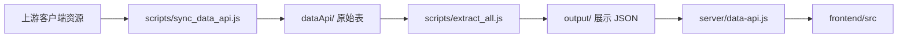

# 开发文档

## 1. 项目概述

本项目是一个面向《造梦无双》数据展示与运维的单仓库应用，核心目标是把上游客户端配置资源同步到本地，提取成更适合前端展示的 JSON 数据，并通过一个 Node 服务同时提供：

- 前端静态页面
- 展示数据接口
- 资源更新与运维接口
- 部分计算与查询能力

当前仓库已经是唯一维护版本，后续开发应直接在本目录内进行。

## 2. 技术栈

### 前端

- React 19
- TypeScript 5
- Vite 7
- Tailwind CSS 4
- Recharts

### 服务端

- Node.js 22+
- 原生 `http` 服务
- `worker_threads` 处理玩家改名检索

### 数据侧

- `dataApi/`：从上游客户端同步下来的原始配置表与对应 JSON
- `output/`：供前端直接消费的展示层 JSON
- `file/mini_data.db`：玩家改名检索使用的 SQLite 数据库

## 3. 目录结构

```text
deployable-app/
├─ frontend/                  前端工程
│  ├─ src/
│  │  ├─ pages/               页面级视图
│  │  ├─ components/          业务组件
│  │  ├─ hooks/               数据加载与状态封装
│  │  └─ lib/                 前端 API 与工具函数
│  └─ dist/                   前端构建产物
├─ server/                    Node 服务
├─ scripts/                   数据同步、提取与运维脚本
│  └─ extract/                各子系统提取脚本
├─ dataApi/                   上游同步得到的原始配置
├─ output/                    前端展示使用的 JSON 数据
├─ file/                      运行期文件、数据库、日志
├─ deploy/standalone-server/  Linux/部署脚本
├─ settings.js                统一运行配置
└─ docs/开发文档.md           本文档
```

## 4. 核心架构

### 4.1 数据流



### 4.2 运行模式

项目默认是“单服务交付”模式：

- `server/data-api.js` 提供 `/api/*` 接口
- 同时托管 `frontend/dist` 静态资源
- 线上部署时通常只启动这一份 Node 服务

本地开发时可以拆成两个进程：

1. Vite 开发服务器
2. Node 数据接口服务

Vite 默认将 `/api` 代理到 `http://127.0.0.1:2317`。

## 5. 环境要求

- Node.js 22 或更高版本
- npm
- Windows 或 Linux

建议：

- 本地开发使用与线上一致的 Node 22
- 修改提取脚本前，先保留一份可用的 `output/` 数据，便于回归比对

## 6. 快速开始

### 6.1 安装前端依赖

```powershell
cd frontend
npm ci
```

### 6.2 启动后端接口服务

在项目根目录执行：

```powershell
node server/data-api.js
```

默认监听：

```text
http://127.0.0.1:2317
```

### 6.3 启动前端开发服务器

另开一个终端：

```powershell
cd frontend
npm run dev
```

说明：

- 前端请求 `/api/*` 时会走 Vite 代理
- 需要保证 `server/data-api.js` 已经启动
- 如果只想看已构建产物，可直接运行根目录启动脚本

### 6.4 一键启动

Windows：

```powershell
.\start-ui.bat
```

或：

```powershell
.\manage.bat bootstrap
.\manage.bat bootstrap-ops
```

Linux：

```bash
bash bootstrap.sh
bash manage.sh bootstrap
bash manage.sh bootstrap-ops
```

## 7. 常用开发命令

### 前端

```powershell
cd frontend
npm run dev
npm run build
npm run lint
```

`npm run build` 实际会执行：

1. `tsc -b`
2. `vite build`

### 后端 / 项目根目录

```powershell
node server/data-api.js
node scripts/sync_data_api.js
node scripts/extract_all.js
node scripts/extract_all.js equip
node scripts/run_update_pipeline.js
```

脚本说明：

- `sync_data_api.js`：从上游客户端同步配置资源到 `dataApi/`
- `extract_all.js`：把 `dataApi/` 提取成 `output/` 下的展示 JSON
- `run_update_pipeline.js`：顺序执行同步与提取

## 8. 配置说明

统一配置文件为项目根目录的 `settings.js`：

```js
module.exports = {
  server: {
    host: '0.0.0.0',
    port: 2317,
    adminToken: '',
  },
  data: {
    maxLevel: 220,
  },
  autoRefresh: {
    enabled: true,
    intervalMinutes: 360,
    onStart: true,
  },
};
```

关键字段：

- `server.host`：服务监听地址
- `server.port`：服务端口
- `server.adminToken`：运维接口令牌，留空表示不校验
- `data.maxLevel`：默认等级过滤上限
- `autoRefresh.enabled`：是否启用自动刷新
- `autoRefresh.intervalMinutes`：自动刷新间隔
- `autoRefresh.onStart`：服务启动时是否自动执行一次更新流水线

## 9. 环境变量

`server/data-api.js` 额外支持以下运行时环境变量：

- `DATA_API_WEB_DIST_DIR`
  - 指定前端静态资源目录
- `DATA_API_ENABLE_OPS`
  - 是否启用运维面板与管理接口
- `DATA_API_ENABLE_PLAYER_NAME_SEARCH`
  - 是否启用玩家改名检索接口

示例：

```powershell
$env:DATA_API_ENABLE_OPS="true"
$env:DATA_API_ENABLE_PLAYER_NAME_SEARCH="true"
node server/data-api.js
```

## 10. 前端开发说明

### 10.1 页面入口

前端主入口为：

- `frontend/src/main.tsx`
- `frontend/src/App.tsx`

`App.tsx` 负责：

- 左侧导航切换
- 页面懒加载
- 全局搜索入口
- 根据 `/api/health` 判断是否展示运维模块

### 10.2 页面组织

主要页面位于 `frontend/src/pages/`，当前包含：

- 角色装备
- 灵宝系统
- 翅膀系统
- 修炼系统
- 宠物系统
- 坐骑系统
- 时装系统
- 神魔属性
- BOSS 属性
- 抗值标准
- 玩家改名记录
- 帮助与反馈
- 资源运维

新增一个业务页面时，通常需要同时修改：

1. `frontend/src/pages/` 下新增页面组件
2. `frontend/src/App.tsx` 注册懒加载与切换逻辑
3. `frontend/src/components/layout/SideNav.tsx` 增加导航入口
4. 如有新接口，更新 `frontend/src/lib/api.ts`

### 10.3 数据加载

前端主要通过 `frontend/src/hooks/useGameData.ts` 拉取数据：

- 先请求 `/api/files` 获取当前可用数据文件列表
- 再逐个请求 `/api/data/:name`
- 通过 `/api/stream` 监听 SSE 事件，实现文件变更后的前端自动刷新

系统与 JSON 文件的映射规则也在该 Hook 内维护，例如：

- `role_spiritual` 会聚合 `role_magic*`、`role_godweapon*`、`role_matrix*`
- `role_cultivate` 会聚合修炼相关多个 JSON
- `resist` 只消费 `exp.json`

如果新增输出 JSON，需要评估是否要同步更新该映射逻辑。

### 10.4 接口封装

`frontend/src/lib/api.ts` 负责前端接口访问封装，当前已包含：

- 玩家改名搜索
- 玩家改名历史
- 用户反馈提交

若新增接口，优先在这里统一封装，不建议在页面组件中散落 `fetch` 细节。

## 11. 后端开发说明

### 11.1 服务入口

后端主入口为：

- `server/data-api.js`

职责包括：

- 提供健康检查
- 读取 `output/` 数据文件
- 应用等级过滤等服务端裁剪逻辑
- 提供玩家改名检索
- 提供战场计算能力
- 提供反馈写入
- 提供运维接口
- 托管前端静态资源

### 11.2 主要接口

公开接口：

- `GET /api/health`
- `GET /api/files`
- `GET /api/data/:name`
- `GET /api/stream`
- `POST /api/feedback`
- `GET /api/player-name/search`
- `GET /api/player-name/history`
- `GET /api/battlefield/config`
- `GET|POST /api/battlefield`

管理接口：

- `GET /api/admin/status`
- `POST /api/admin/settings`
- `POST /api/admin/run`

说明：

- 管理接口依赖 `DATA_API_ENABLE_OPS`
- 如果配置了 `settings.js -> server.adminToken`，请求时需携带 `X-Admin-Token`

### 11.3 运行期文件

常见运行文件：

- `file/runtime/gameanalysis.log`：服务日志
- `file/runtime/gameanalysis.pid`：进程 PID
- `file/runtime/update-status.json`：更新流水线状态
- `file/runtime/feedback-submissions.jsonl`：反馈记录

## 12. 数据提取开发说明

### 12.1 脚本分层

`scripts/` 可以理解为三层：

1. 基础同步层
   - `sync_data_api.js`
2. 聚合调度层
   - `extract_all.js`
   - `run_update_pipeline.js`
3. 具体子系统提取层
   - `scripts/extract/*.js`

### 12.2 新增一个提取模块的流程

1. 在 `scripts/extract/` 下新增对应脚本
2. 导出一个可直接执行的函数
3. 在 `scripts/extract_all.js` 的 `MODULES` 注册表中登记
4. 生成 `output/*.json`
5. 如前端要展示，补充页面或接入已有页面

### 12.3 产物约定

`output/` 下的 JSON 一般采用如下结构：

```json
{
  "_meta": {
    "name": "role_equip_make",
    "system": "role_equip"
  },
  "data": []
}
```

前端依赖 `_meta` 与 `data` 两层结构，提取脚本改动时需要保持兼容。

## 13. 部署与运维说明

### 13.1 Windows

Windows 主要通过以下脚本管理：

- `manage.ps1`
- `manage.bat`
- `start-ui.bat`

`manage.ps1` 会负责：

- 检查 Node
- 安装前端依赖
- 执行前端构建
- 启动/停止 Node 服务
- 写入日志与 PID

### 13.2 Linux

Linux 主要通过：

- `bootstrap.sh`
- `manage.sh`
- `deploy/standalone-server/manage.sh`

特点：

- 要求 Node.js 22+
- 检测到已上传的 `frontend/dist` 时可跳过前端构建
- 低内存服务器默认跳过 `tsc`

### 13.3 自动更新

自动更新依赖两种方式：

- 应用内定时刷新
  - 由 `settings.js -> autoRefresh` 控制
- 系统级计划任务
  - 推荐 Linux `cron`

如果只需要手动更新，可直接触发：

```powershell
node scripts/run_update_pipeline.js
```

## 14. 推荐开发流程

### 14.1 前端样式或页面改动

1. 启动 `node server/data-api.js`
2. 启动 `cd frontend && npm run dev`
3. 在现有 `output/` 数据基础上联调页面
4. 改完后执行 `npm run build`

### 14.2 数据提取改动

1. 先确认依赖的是 `dataApi/` 哪些原始表
2. 修改 `scripts/extract/*.js`
3. 执行 `node scripts/extract_all.js` 或指定模块提取
4. 对比 `output/` 变化是否符合预期
5. 再打开前端页面做展示验证

### 14.3 全链路更新

1. 执行 `node scripts/run_update_pipeline.js`
2. 检查 `dataApi/` 是否同步成功
3. 检查 `output/` 是否生成新文件
4. 启动前后端验证接口与页面

## 15. 常见问题

### 15.1 页面空白或数据加载失败

优先检查：

- `server/data-api.js` 是否已启动
- 端口是否仍为 `2317`
- `output/` 下是否存在对应 JSON
- 浏览器请求的 `/api/*` 是否返回 200

### 15.2 运维面板不显示

检查是否通过以下方式启动：

- `manage.bat bootstrap-ops`
- `manage.bat start-ops`
- `bash manage.sh bootstrap-ops`
- 设置 `DATA_API_ENABLE_OPS=true`

### 15.3 玩家改名查询不可用

检查：

- 是否设置了 `DATA_API_ENABLE_PLAYER_NAME_SEARCH=true`
- `file/mini_data.db` 是否存在

### 15.4 修改了提取脚本但前端没刷新

这是正常现象中的常见情况，通常有两类原因：

- 没有重新执行提取脚本，`output/` 没更新
- 页面依赖的文件名与 `useGameData` 过滤规则不匹配

## 16. 开发约束建议

- 不要直接手改 `frontend/dist/`，它属于构建产物
- 不要直接手改 `output/` 作为长期方案，优先回到提取脚本修正
- `dataApi/` 主要是同步产物，除排查问题外不建议人工维护
- 新接口优先保持返回结构稳定，避免破坏现有页面
- 新增页面前，优先复用 `hooks/`、`lib/` 和现有业务组件

## 17. 后续建议

如果后面要继续完善工程化，建议优先补这几项：

- 为 `server/` 补充更清晰的模块拆分
- 为 `scripts/extract/` 建立统一输出 schema 校验
- 为关键提取脚本添加样例测试
- 为前端页面建立最小回归校验清单

## 18. 二次开发详细指南

这一节专门说明：如果要在当前项目基础上继续“额外开发”，应该按什么思路推进，分别改哪些地方，怎样避免把现有链路改坏。

### 18.1 先判断你要做的是哪一类扩展

进入开发前，先把需求归类。这个项目的扩展通常只会落在下面几种情况里：

1. 新增展示页面
   - 例如新增一个“灵兽羁绊”“副本掉落总览”页面
2. 给现有页面加字段、筛选、图表、搜索
   - 例如给 BOSS 页面增加额外属性列
3. 新增后端接口
   - 例如新增一个 `/api/xxx/summary`
4. 新增数据提取模块
   - 例如从 `dataApi/` 里的新表提取一个新的 `output/*.json`
5. 新增运维能力
   - 例如让运维面板多一个“只同步 dataApi”按钮
6. 新增配置项
   - 例如给 `settings.js` 多一个新的开关

先分类的原因很简单：这个项目是“前端展示 + 后端读取 + 脚本提取”三层联动，如果一开始不知道改动属于哪层，很容易多改、乱改，最后问题不好排。

### 18.2 二次开发的基本原则

后续扩展时，建议一直遵守下面这几条：

- 先定数据，再定页面
  - 先确认需要什么 JSON 结构，再开始写组件
- 尽量不直接依赖 `dataApi/` 原始表做前端展示
  - 更推荐先进入 `scripts/extract/`，转换成稳定的 `output/*.json`
- 优先复用已有模块的命名方式和目录结构
  - 例如 `role_xxx`、`pet_xxx`、`ride_xxx`
- 不要把页面逻辑写进 Hook，不要把接口细节散落进页面
  - 页面负责展示，`lib/api.ts` 负责请求，`hooks/` 负责数据编排
- 不要直接改构建产物
  - `frontend/dist/`、多数情况下的 `dataApi/`、临时调试改出来的 `output/` 都不应作为长期维护入口

### 18.3 推荐的扩展决策顺序

拿到一个新需求后，建议按这个顺序决策：

1. 这个功能最终要展示什么内容？
2. 这些内容现在 `output/` 里有没有现成数据？
3. 如果没有，能否由 `dataApi/` 的现有表提取出来？
4. 如果能提取，输出文件名和结构应该叫什么？
5. 前端是放进现有页面，还是新增独立页面？
6. 是否需要后端做额外计算、过滤或权限控制？

这样处理后，开发链路会比较稳：

```text
需求 -> 输出数据结构 -> 提取脚本/接口 -> 前端接入 -> 联调 -> 回归
```

### 18.4 场景一：新增一个展示模块

这是最常见的二次开发场景。一个完整的新模块，一般要改 4 个层面。

#### 第一步：定义输出数据文件

先想清楚最后要给页面消费的 JSON 长什么样。建议继续沿用：

```json
{
  "_meta": {
    "name": "new_system_summary",
    "system": "new_system"
  },
  "data": []
}
```

建议：

- `name` 保持和输出文件名一致
- `system` 对应前端的系统标识
- `data` 尽量用结构稳定的对象数组

如果页面需要多个视图，可以拆成多个 JSON，例如：

- `new_system_base.json`
- `new_system_upgrade.json`
- `new_system_reward.json`

不要把完全不同语义的内容硬塞进一个超大 JSON。

#### 第二步：编写提取脚本

在 `scripts/extract/` 下新增脚本，例如：

```text
scripts/extract/new_system.js
```

脚本职责应该尽量单一：

- 读取 `dataApi/` 某些原始 JSON
- 做清洗、映射、去重、排序
- 写入 `output/` 下一个或多个文件

推荐做法：

- 把“表字段兼容”“默认值处理”“命名规范化”放在提取阶段处理掉
- 尽量不要把这些脏活留给前端页面

完成后，在 `scripts/extract_all.js` 的 `MODULES` 中注册新模块。

#### 第三步：让前端能加载到它

如果是独立系统，需要至少处理下面几处：

1. `frontend/src/App.tsx`
   - 注册页面懒加载
   - 配置 `SYSTEM_META`
   - 把系统加入 `KNOWN_SYSTEMS`
2. `frontend/src/components/layout/SideNav.tsx`
   - 增加导航入口
3. `frontend/src/hooks/useGameData.ts`
   - 如果输出文件命名不符合默认前缀规则，需要补过滤映射
4. `frontend/src/pages/`
   - 新建页面组件

这里最关键的是 `useGameData.ts`。因为前端不是盲目加载全部文件，而是根据系统名筛选可见文件。如果你新增的输出文件名不符合当前前缀规则，页面会出现“接口没报错但数据始终为空”的现象。

#### 第四步：写页面组件

新增页面时建议不要一步写太大，推荐拆法如下：

1. 页面负责布局、模块组合
2. 复杂表格放到 `components/`
3. 纯转换逻辑放到 `lib/`
4. 多页面复用的数据处理可抽到 `hooks/`

这样后续继续迭代时不容易失控。

### 18.5 场景二：给现有页面加功能

如果只是给现有模块补功能，不一定需要新增提取脚本。可以按下面顺序判断：

#### 情况 A：`output/` 里已经有数据

这种情况最简单，只需要：

1. 查清楚对应页面用了哪些 `dataSources`
2. 在页面或组件中消费新增字段
3. 补搜索、排序、筛选、图表等交互

建议先搜页面里已有的数据键名，再决定是否要改提取层。

#### 情况 B：`output/` 缺字段，但原始表里有

此时优先改 `scripts/extract/*.js`，把字段补进输出文件。

原因：

- 逻辑更集中
- 页面不用懂原始表结构
- 后续其他页面也能复用这个字段

#### 情况 C：需要后端实时计算

例如：

- 多个 JSON 合并后动态排序
- 根据请求参数计算推荐值
- 输入一组参数后返回计算结果

这类需求更适合加后端接口，而不是把计算全部堆在前端。

### 18.6 场景三：新增后端接口

如果要在 `server/data-api.js` 里新增接口，建议按以下步骤来。

#### 第一步：确定接口类型

先判断接口属于哪一类：

- 读现成文件
- 做动态计算
- 写运行期数据
- 运维控制接口

不同类型的接口，稳定性要求不同：

- 展示数据接口要尽量稳定、可缓存、结构清晰
- 写入接口要更重视参数校验和限流
- 运维接口要考虑权限

#### 第二步：先设计返回结构

建议先写出一个固定返回示例，例如：

```json
{
  "ok": true,
  "items": [],
  "summary": {}
}
```

返回结构稳定，比实现方式更重要。因为一旦前端接入后，结构经常变就会造成二次返工。

#### 第三步：实现接口逻辑

当前 `server/data-api.js` 是集中式路由，新增接口时建议照着现有风格写：

- 参数解析尽量单独封装
- 业务校验用明确错误码
- 对 400/404/409/429/500 做区分

如果新增的是复杂能力，推荐同时把核心逻辑抽成独立模块，而不是继续把整个实现塞进 `data-api.js`。

可参考当前已拆出的：

- `server/battlefield-service.js`
- `server/player-search-worker.js`

#### 第四步：前端统一封装调用

不要在页面里直接写一堆 `fetch('/api/xxx')`。

推荐做法：

1. 在 `frontend/src/lib/api.ts` 增加函数
2. 给响应定义 TypeScript 类型
3. 页面里直接调用封装函数

好处是：

- 错误处理更统一
- 类型更清晰
- 后面改接口路径时只用改一处

### 18.7 场景四：新增数据提取能力

如果额外开发的重点在“资源表解析”而不是页面本身，那么你真正要维护的是提取层。

#### 建议的开发步骤

1. 先在 `dataApi/` 找出相关原始表
2. 明确这些表之间的主键/外键关系
3. 写一个最小可运行版本，只生成最核心字段
4. 先产出一个 JSON，确认页面能读
5. 再逐步补字段、补计算、补格式化

#### 提取脚本里建议做的事

- 字段重命名
- 数值单位换算
- 过滤测试脏数据
- 多表 join
- 生成展示友好的 label
- 写入 `_meta`

#### 不建议在提取脚本里做的事

- 与页面布局强绑定的拼接文案
- 只服务某一个按钮状态的临时字段
- 过于前端化的颜色、样式判断

提取层最好保持“面向展示、但不面向具体 CSS”。

### 18.8 场景五：新增运维按钮或后台能力

如果你要扩展“资源运维”面板，通常会同时修改前后端两侧。

#### 后端侧

一般落在：

- `server/data-api.js`

常见方式：

- 在 `/api/admin/run` 里扩展新的 `task`
- 或新增单独的 `/api/admin/...` 路由

如果是新增任务，建议保持和现有 `TASK_SCRIPTS` 一致的模式：

- 任务名清晰
- 脚本入口单独存在
- 运行状态可回写到 `update-status.json`

#### 前端侧

一般落在：

- `frontend/src/pages/OpsDashboard.tsx`
- `frontend/src/hooks/useOpsStatus.ts`
- `frontend/src/lib/api.ts`

推荐把“状态查询”和“任务触发”分开写，避免组件里一边拉状态一边直接拼装请求。

### 18.9 场景六：新增配置项

如果二次开发需要可配置能力，比如：

- 新增默认筛选条件
- 新增开关
- 新增刷新参数

建议按照下面顺序改：

1. 修改 `server/app-config.js`
   - 增加默认值、归一化逻辑、持久化逻辑
2. 修改 `settings.js`
   - 补默认字段
3. 如果运维面板可编辑，再改前端设置页
4. 在服务端读取配置时提供 fallback

注意：新增配置不是简单把字段写进 `settings.js` 就完了，`app-config.js` 的规范化逻辑一定要一起更新，不然重启后可能被自动清洗掉。

### 18.10 代码应该改到哪里，不应该改到哪里

这是二次开发时最容易踩坑的地方。

#### 应该改

- `frontend/src/`
- `server/`
- `scripts/`
- `settings.js`
- 新增的 `docs/`

#### 谨慎改

- `output/`
  - 只适合调试验证，不适合长期手工维护
- `dataApi/`
  - 主要是同步产物，除非为了定位上游问题，不建议直接改
- `file/`
  - 运行期目录，通常不作为功能开发入口

#### 不应该作为长期修改入口

- `frontend/dist/`
  - 构建产物，重建会覆盖

### 18.11 一个完整的新增功能范例

假设现在要新增“星图养成”模块，可以按这条路线做：

#### 第 1 步：确认数据来源

先去 `dataApi/` 找和星图有关的配置表，例如：

- 星图基础表
- 升级消耗表
- 奖励或属性表

#### 第 2 步：定义输出

约定输出：

- `output/role_starmap_base.json`
- `output/role_starmap_upgrade.json`

#### 第 3 步：实现提取脚本

新增：

```text
scripts/extract/role_starmap.js
```

并在 `scripts/extract_all.js` 注册。

#### 第 4 步：前端接入

新增：

- `frontend/src/pages/RoleStarMap.tsx`

更新：

- `frontend/src/App.tsx`
- `frontend/src/components/layout/SideNav.tsx`
- `frontend/src/hooks/useGameData.ts`

#### 第 5 步：联调

执行：

```powershell
node scripts/extract_all.js starmap
node server/data-api.js
cd frontend
npm run dev
```

#### 第 6 步：回归

检查：

- 页面能否正常进入
- 新输出文件能否被 `/api/files` 识别
- `/api/data/role_starmap_base` 是否可访问
- 页面切换时是否报错
- 搜索、筛选是否受影响

### 18.12 联调时推荐的检查清单

每次做额外开发，至少过一遍下面这份清单。

#### 数据层

- 提取脚本是否成功执行
- `output/` 是否生成了预期文件
- `_meta` 是否完整
- `data` 是否是前端可消费的结构

#### 接口层

- `/api/files` 是否能看到新文件
- `/api/data/:name` 是否返回 200
- 错误参数时是否返回合理错误
- 是否需要鉴权、限流、开关控制

#### 前端层

- 首次加载是否正常
- 切换页面是否正常
- 空数据时是否有兜底视图
- 搜索、筛选、图表是否还能工作
- 移动端布局是否被破坏

#### 运维层

- `manage.bat bootstrap` 是否还能正常启动
- 构建后 `frontend/dist` 是否正常
- 运维面板在关闭状态下是否不会误暴露

### 18.13 如何控制额外开发的风险

建议把每次扩展控制成“小步快跑”，不要一口气同时改：

- 提取脚本
- 后端路由
- 页面结构
- 样式体系
- 运维面板

更稳的节奏是：

1. 先打通数据
2. 再补接口
3. 再做页面
4. 最后再做交互优化和样式 polish

因为这个项目的核心价值是“数据能稳定出、页面能稳定看”，先保住主链路，再做增强最划算。

### 18.14 推荐的提交粒度

如果你后面要长期维护，建议按功能拆小提交，典型可以拆成：

1. `feat(extract): 新增 xxx 数据提取`
2. `feat(api): 新增 xxx 查询接口`
3. `feat(frontend): 新增 xxx 页面`
4. `chore(docs): 更新开发文档`

这样后续回滚、排查、对比都会轻松很多。

### 18.15 最后一个实用建议

在这个项目里，最省时间的做法不是“先把页面搭出来”，而是：

1. 先找到正确的原始表
2. 先把 `output/*.json` 设计稳定
3. 再让前端消费稳定数据

只要 `output/` 这一层设计得干净，后面的额外开发通常都会轻松很多；反过来，如果直接让页面依赖零散原始表，后续每加一个功能都会越来越难维护。
